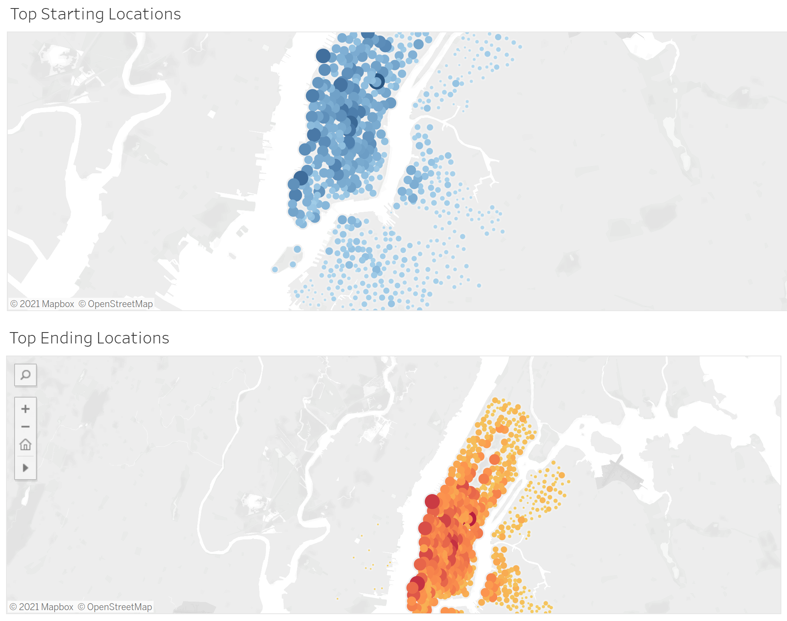
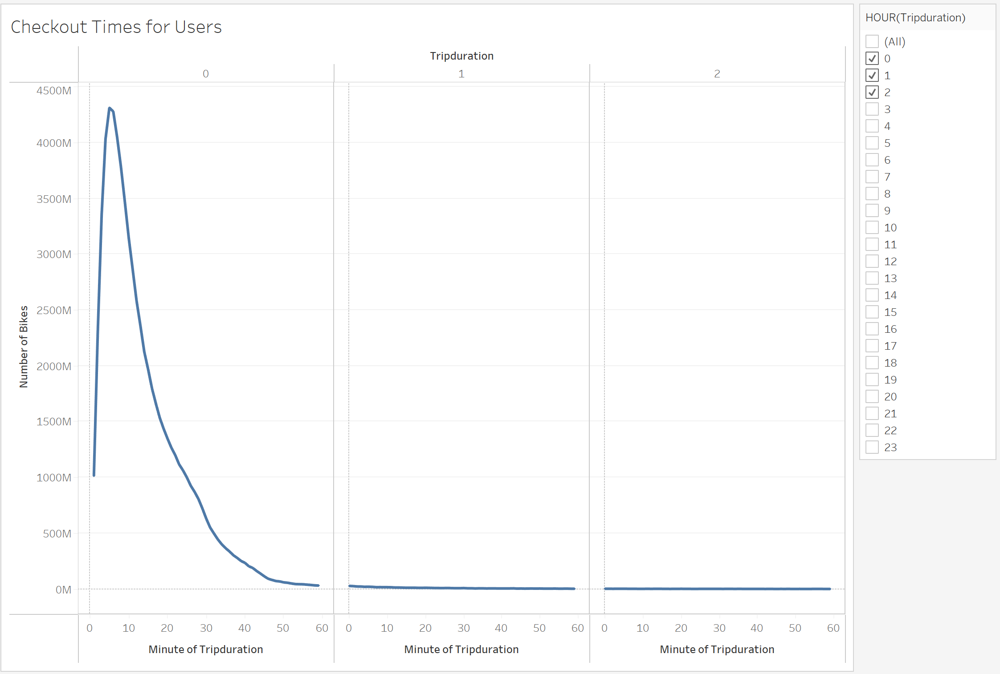
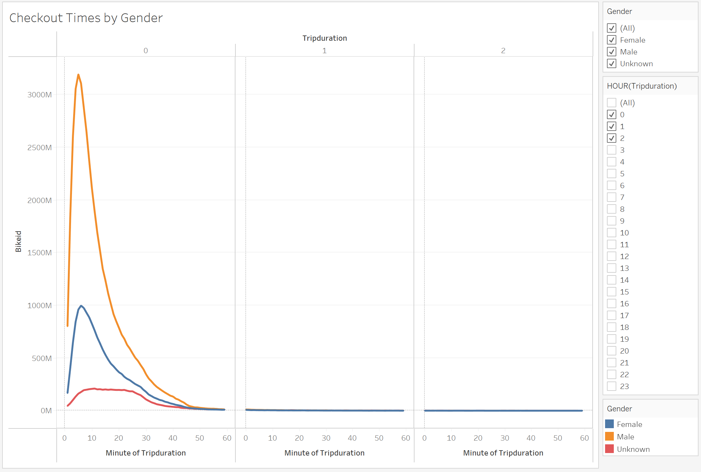
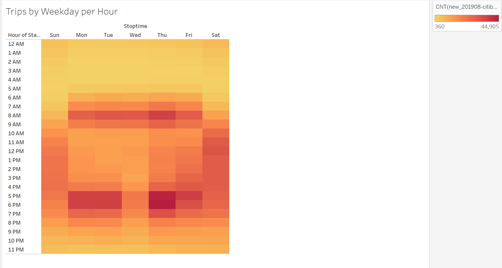
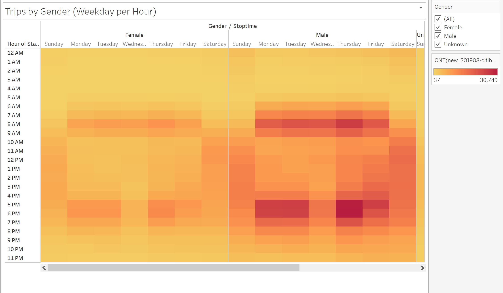
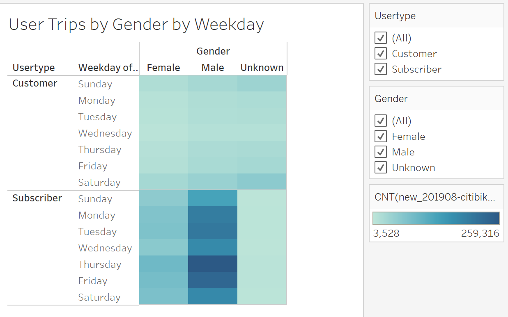

# bikesharing

## Overview of the analysis

To convince investors that a bike-sharing program in Des Moines is a solid business proposal. To solidify the proposal, one of the key stakeholders would like to see a bike trip analysis.

For this analysis, we use Pandas to change the "tripduration" column from an integer to a datetime datatype. Then, using the converted datatype, we create a set of visualizations to:

- Show the length of time that bikes are checked out for all riders and genders
- Show the number of bike trips for all riders and genders for each hour of each day of the week
- Show the number of bike trips for each type of user and gender for each day of the week.

The most popular places for Citibike customers to begin their journeys are also the same for thier ending locations. 

The peak useage for NYC citibikes occurs at 5 minutes and then gradulally decreases.

We see that majority of checkouts are from Males.

Majority of the trips are around 4pm-6pm during the weekdays.

For both genders the trips are both higher during 4p-6p, however there are more males verses females.

You can see that there are more male subscribers than female, as well as more subscribers who will use verses just customers. 

## Summary

In order to determine if Citibikes is a good fit for Des Moines, I believe we would need more analystic data. We would need to check the population and possibly environment of the surroundings. If Des Moines has greater population than New York City's then Citibikes would have a good potential.  

[Link to Tableau Public](https://public.tableau.com/app/profile/lin5570/viz/NYCCitiBike_16320317202900/NYCCitiBike?publish=yes)
